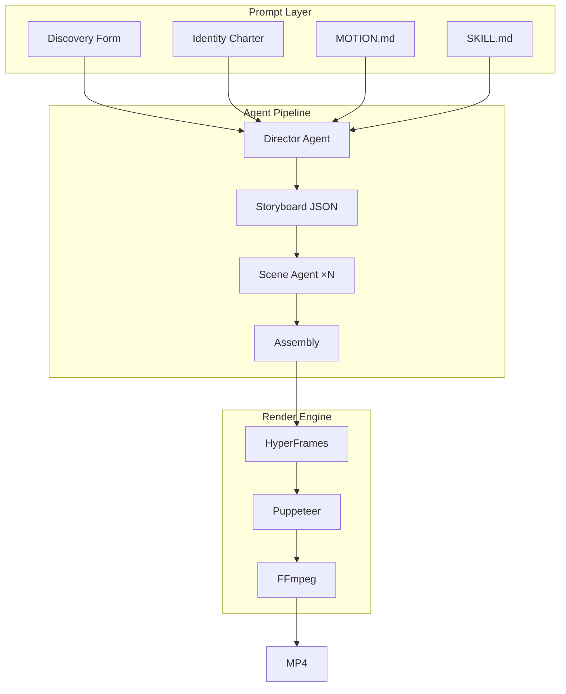

# Code2MP4

> **AI agents can write code. Now they can write videos.**

Code2MP4 is an open-source, agent-native video production pipeline. It lets coding agents like Claude Code, OpenCode, and Codex generate editable motion source and render it into deterministic MP4 output — not as a black box, but as structured, version-controllable source files.


<p align="center">
  <a href="LICENSE"></a>
  <a href="https://code2mp4.com"></a>
</p>

<p align="center"><b>English</b> · <a href="README.zh-CN.md">简体中文</a></p>

---

## What Code2MP4 is

Code2MP4 is a **production pipeline for agent-generated videos**, not a black-box text-to-video model.

```
Black-box AI video:   Prompt ──────────────────────► MP4 (opaque, uneditable)

Code2MP4:             Prompt → Storyboard → Motion Source → Render → MP4
                                       ↑ editable, version-controlled
```

Every video produced by Code2MP4 has a **storyboard** (structured JSON), **motion source** (editable HTML/CSS/GSAP), and **deterministic MP4** (same input = same output). You can inspect, edit, version, and repeat.

## What Code2MP4 is not

- ❌ Not a photoreal text-to-video model (Sora, Veo, Kling, Runway)
- ❌ Not a manual timeline editor (Premiere, DaVinci, CapCut)
- ❌ Not a hosted SaaS — runs locally on your machine
- ❌ Not a simple code-to-MP4 format converter

## The comparison that matters

| Capability | Black-box text-to-video | Traditional editors | HyperFrames | **Code2MP4** |
|---|---|---|---|---|
| Editable source | No | Partial | Yes | **Yes** |
| Deterministic output | No | Yes | Yes | **Yes** |
| Agent-native workflow | No | No | Partial | **Yes** |
| Git-friendly | No | No | Yes | **Yes** |
| CI/CD ready | No | No | Partial | **Yes** |
| Storyboard-driven | No | No | No | **Yes** |
| Multi-agent pipeline | No | No | No | **Yes** |
| Best for | cinematic generation | human editing | rendering engine | **agent-driven production** |

---

## Quickstart

```bash
git clone https://github.com/code2mp4/code2mp4.git
cd code2mp4
corepack enable
pnpm install
pnpm dev
```

Open `http://localhost:7456`. Pick a video type, describe what you want, press send.

### Prerequisites

- **Node.js** ≥ 22
- **pnpm** ≥ 10
- **An AI agent CLI** (pick one):
  ```bash
  npm i -g @anthropic-ai/claude-code   # Claude Code (recommended)
  npm i -g opencode                     # OpenCode
  ```
- **HyperFrames** (for rendering): `npm i -g hyperframes`
- **FFmpeg** (for video encoding): `brew install ffmpeg`

---

## How it works

### The pipeline

Code2MP4 orchestrates a multi-stage pipeline driven by coding agents:

1. **Discovery** — Interactive question forms gather video type, duration, energy, audio needs
2. **Director Agent** — Generates a structured storyboard (JSON with scenes, visuals, text, motion)
3. **Scene Agent** — Each scene becomes an editable motion source fragment (HTML + CSS + GSAP)
4. **Assembly** — Scenes are combined into a complete HyperFrames composition
5. **Render** — Puppeteer + FFmpeg produce a deterministic MP4



### Prompt stack (7 layers)

The system prompt that drives the agent is carefully composed from seven layers:

| Layer | Purpose |
|---|---|
| 1. Discovery | Hard rules for interactive turn-1 question forms |
| 2. Identity | Compact producer identity charter |
| 3. Motion system | Palette, fonts, easing signatures, transition rules |
| 4. Script system | Narrative arc, pacing, hook patterns |
| 5. Video skill | Scene counts, animation patterns, output checklist |
| 6. Project metadata | User-selected type, duration, aspect ratio, energy |
| 7. HyperFrames contract | Load-bearing composition rules (pinned last) |

---

## Features

| | |
|---|---|
| **Agents** | Claude Code · OpenCode · Codex CLI · Gemini CLI · Cursor Agent · Qwen Code — auto-detected on PATH |
| **Motion systems** | 5 curated directions (Editorial · Tech · Warm & Soft · Cinematic · Brutalist) — each a deterministic palette, font stack, easing signature, and transition matrix |
| **Script systems** | 3 narrative structures (Tech Demo · Product Launch · Brand Story) with hook patterns and pacing maps |
| **Video skills** | 6 composable workflows — SKILL.md bundles with scene templates, animation rules, and output checklists |
| **Multi-stage pipeline** | Director Agent → Storyboard → Scene Agents → Assembly — per-scene retry, filesystem persistence |
| **Deterministic rendering** | Same motion source = same MP4 output. HyperFrames engine (Puppeteer + FFmpeg) |
| **Dual preview** | `<hyperframes-player>` for design review + `<video>` tag for playback |
| **SQLite persistence** | Projects, conversations, messages with CASCADE delete |
| **SSE streaming** | Real-time agent output — text, tool calls, render progress |
| **License** | Apache 2.0 |

---

## Examples

Three examples illustrate what Code2MP4 is built for:

| Example | Description | Storyboard | Output |
|---|---|---|---|
| [Product Launch](examples/product-launch/) | 30s SaaS product launch video — problem → promise → features → CTA | [storyboard.json](examples/product-launch/storyboard.json) | MP4 |
| [OSS Intro](examples/oss-intro/) | Code2MP4 self-intro video — what → why → how → get started | [storyboard.json](examples/oss-intro/storyboard.json) | MP4 |
| [Release Notes](examples/release-notes/) | Changelog-to-video — version → new features → improvements → upgrade | [storyboard.json](examples/release-notes/storyboard.json) | MP4 |

---

## Use cases

- Product launch videos for SaaS
- Open-source project intro videos
- Release note / changelog videos
- Developer documentation explainers
- Social media motion cards
- Automated CI/CD video generation

---

## Docs

| Document | Purpose |
|---|---|
| [Vision](docs/vision.md) | Why agents need video as an output format |
| [Comparison](docs/comparison.md) | How Code2MP4 differs from black-box tools, Remotion, HyperFrames, and Open Design |
| [Architecture](docs/architecture.md) | Full pipeline architecture — prompt stack, agent orchestration, render engine |
| **Production schemas** | |
| [Brief Schema](docs/brief-schema.md) | Video intent model — goal, audience, format, constraints (`brief.json`) |
| [Script Schema](docs/script-schema.md) | Narrative structure — hook, segments, pacing, CTA (`script.json`) |
| [Storyboard Schema](docs/storyboard-schema.md) | Structured scene plan — visuals, text, motion (`storyboard.json`) |
| [Scene Schema](docs/scene-schema.md) | Per-scene agent spec — layout, elements, motion grammar (`scene.json`) |
| [Render Config](docs/render-config.md) | Execution config — quality, fps, resolution, variants (`render.config.json`) |
| [Quality Checklist](docs/quality-checklist.md) | Video Review Theater — 7 dimensions, 40+ checks (`quality-report.json`) |
| **Guides** | |
| [Agent Workflow](docs/agent-workflow.md) | Step-by-step guide for coding agents using Code2MP4 |
| [Templates](docs/templates.md) | Template system documentation |
| [Roadmap](ROADMAP.md) | Development phases and milestones |

---

## Relationship to HyperFrames and Open Design

Code2MP4 is built on the shoulders of two foundational projects:

- **[HyperFrames](https://github.com/heygen-com/hyperframes)** is the **render engine**. It solves HTML-to-MP4: capturing frames via Puppeteer, encoding via FFmpeg, muxing to deterministic MP4. Code2MP4 does not reimplement rendering — it delegates to HyperFrames.

- **[Open Design](https://github.com/nexu-io/open-design)** pioneered the **agent orchestration patterns** that Code2MP4 adapts for video: multi-layer prompt stacking, agent auto-detection, interactive discovery forms, SSE run streaming, and filesystem-backed projects.

```
HyperFrames = render engine
Open Design  = agent orchestration (design)
Code2MP4     = agent-native video production pipeline
```

---

## Roadmap

- [x] v0.1 — Stable local prompt-to-MP4 workflow
- [x] v0.2 — Agent adapters (6 CLIs), SSE streaming, run lifecycle
- [x] v0.3 — Compact prompt stack, motion systems, script systems
- [x] v0.4 — Multi-stage pipeline (Director → Scene → Assembly)
- [ ] v0.5 — Template gallery, transcribe pipeline, remove-background, composition variables
- [ ] v0.6 — CLI-first workflow, 4K rendering, `code2mp4` npm package
- [ ] v0.7 — Hosted rendering experiments
- [ ] v1.0 — Stable release with comprehensive documentation

---

## Contributing

See [CONTRIBUTING.md](CONTRIBUTING.md). Before submitting a PR:

```bash
pnpm typecheck && pnpm build && pnpm test
```

## License

Apache 2.0 © Code2MP4 contributors. See [LICENSE](LICENSE).
