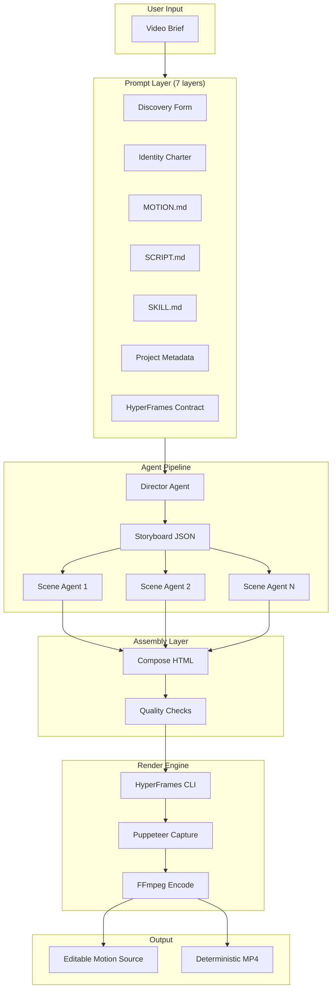

# Architecture

Code2MP4 is a multi-layer pipeline that transforms natural language video descriptions into editable motion source and deterministic MP4 output.

## High-level architecture



## Layer 1: Prompt composition

The system prompt sent to coding agents is composed from 7 layers:

| Order | Layer | Purpose | Source |
|---|---|---|---|
| 1 | Discovery | Hard rules for interactive turn-1 question forms | `prompts/video-discovery.ts` |
| 2 | Identity | Compact producer identity charter (~200 chars) | `prompts/video-identity.ts` |
| 3 | Motion System | Palette, fonts, easing, transitions from active MOTION.md | `motion-systems/<name>/MOTION.md` |
| 4 | Script System | Narrative arc, pacing, hook patterns from SCRIPT.md | `script-systems/<name>/SCRIPT.md` |
| 5 | Video Skill | Scene count, animation patterns, output checklist from SKILL.md | `video-skills/<name>/SKILL.md` |
| 6 | Metadata | User-selected type, duration, aspect ratio, energy | Frontend → API |
| 7 | Contract | HyperFrames load-bearing composition rules (pinned last) | `prompts/video-contract.ts` |

The contract is always pinned at the end so its rules beat any softer instructions above it.

## Layer 2: Agent orchestration

### Agent detection (`agents.ts`)

Code2MP4 scans the user's PATH for known coding agent CLIs. Currently supports:
- Claude Code (`claude`)
- OpenCode (`opencode`)
- Codex CLI (`codex`)
- Gemini CLI (`gemini`)
- Cursor Agent (`cursor-agent`)
- Qwen Code (`qwen`)

### Agent runner (`agent-runner.ts`)

Spawns the detected agent as a child process with environment variables that tell it how to reach the Code2MP4 server:

```
OD_BIN          → path to the `od` CLI dispatcher
OD_PROJECT_ID   → current project identifier
OD_PROJECT_DIR  → filesystem path to project directory
OD_DAEMON_URL   → the server URL (http://localhost:7456)
```

### Run manager (`runs.ts`)

Manages agent lifecycle:
- Creates runs with unique IDs and messages
- Streams agent output as Server-Sent Events (SSE)
- Supports cancellation
- Auto-cleanup after 30-minute TTL

## Layer 3: Multi-stage pipeline

### Stage 1: Director Agent

The Director receives the compact storyboard prompt (~2K chars) and generates a structured JSON storyboard:

```json
{
  "title": "Product Launch Video",
  "duration": 30,
  "aspectRatio": "16:9",
  "scenes": [
    {
      "id": "problem",
      "duration": 7,
      "goal": "Establish the problem the product solves",
      "visual": "Dark background, problem text reveals character by character",
      "text": "Managing deployments is hard.",
      "motion": "Typewriter reveal with cursor blink",
      "audio": "Subtle tension drone"
    }
  ]
}
```

### Stage 2: Scene Agent

Each scene is generated by a separate agent call (~1K prompt). The scene agent receives:

1. The original brief
2. The storyboard (context)
3. The scene description (the specific scene to generate)
4. The previous scene's HTML (for visual continuity)

This produces a self-contained HTML fragment with CSS and GSAP animations.

### Stage 3: Assembly

Assembly is pure code — no agent involved. The `assembleComposition()` function:

1. Reads all scene HTML fragments from disk
2. Combines them into a complete HyperFrames HTML composition
3. Inserts scene transitions (crossfade, wipe, or shader)
4. Configures the GSAP timeline with correct `data-start` and `data-duration`
5. Writes the final `index.html` to the project directory

## Layer 4: Render engine

### HyperFrames bridge (`hyperframes-bridge.ts`)

Centralized wrapper for all HyperFrames CLI commands:

| Command | Purpose |
|---|---|
| `hyperframes lint --json` | Validate HTML structure (missing clip class, overlapping tracks) |
| `hyperframes validate --json` | Chrome-based runtime validation |
| `hyperframes inspect --json` | Visual audit (overflow, clipping, contrast) |
| `hyperframes render --format mp4` | Full render: Puppeteer capture + FFmpeg encode |
| `hyperframes tts` | Text-to-speech generation |
| `hyperframes transcribe` | Audio transcription |
| `hyperframes remove-background` | Background removal for presenter overlays |

### Render flow

```
index.html → Puppeteer (frame capture at 30fps)
           → Raw frames (PNG sequence in memory)
           → FFmpeg (x264 encode + AAC audio)
           → MP4 container (moov atom first for streaming)
```

Output is deterministic: same `index.html` → same MP4, every time. No random seeds, no nondeterministic rendering.

## Layer 5: Persistence

### SQLite (`db.ts`)

Stores structured data:
- `projects` — project metadata
- `conversations` — chat threads within a project
- `messages` — individual messages with content and role

CASCADE deletes ensure project deletion removes all related data.

### Filesystem

Stores unstructured artifacts:
- `projects/<id>/` — project workspace (agent writes here)
- `projects/<id>/output.mp4` — rendered video
- `projects/<id>/.hf-cache/` — agent's composition directories
- `projects/.pipelines/` — pipeline state (storyboards, scene fragments)

The filesystem is the source of truth for files; SQLite is the source of truth for metadata.

## Layer 6: Frontend

### SPA architecture (Next.js 16, `apps/web/`)

- **Entry View** — project list with health check
- **Project View** — chat + video preview + file workspace
- **New Project Panel** — 6-dimension config (type, aspect, duration, energy, motion, audio)
- **Motion System Picker** — visual card grid with live preview iframes

### Communication

- REST API for CRUD operations (`POST /api/projects`, etc.)
- SSE for streaming agent output (`GET /api/runs/:id/events`)
- SSE for render progress (`GET /api/media/wait/:taskId`)
